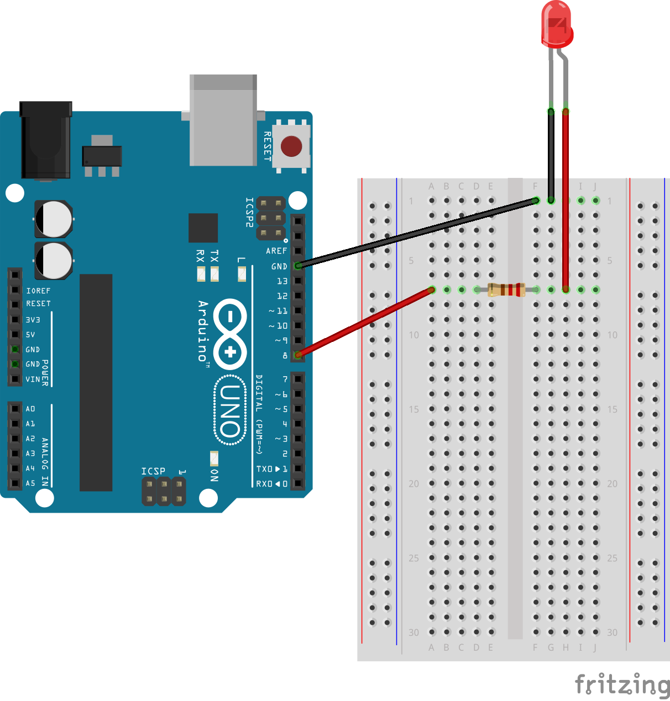
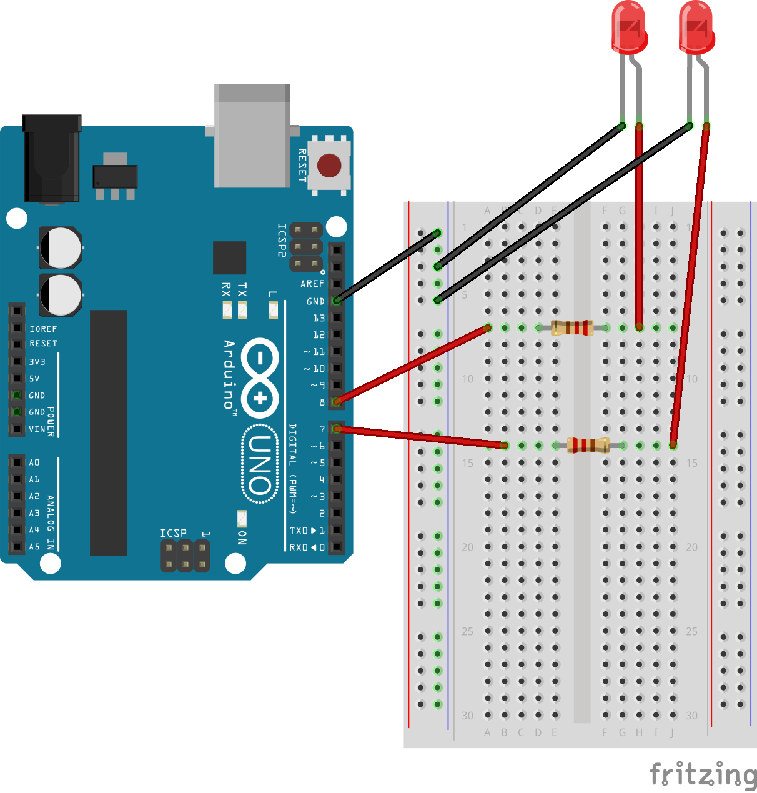
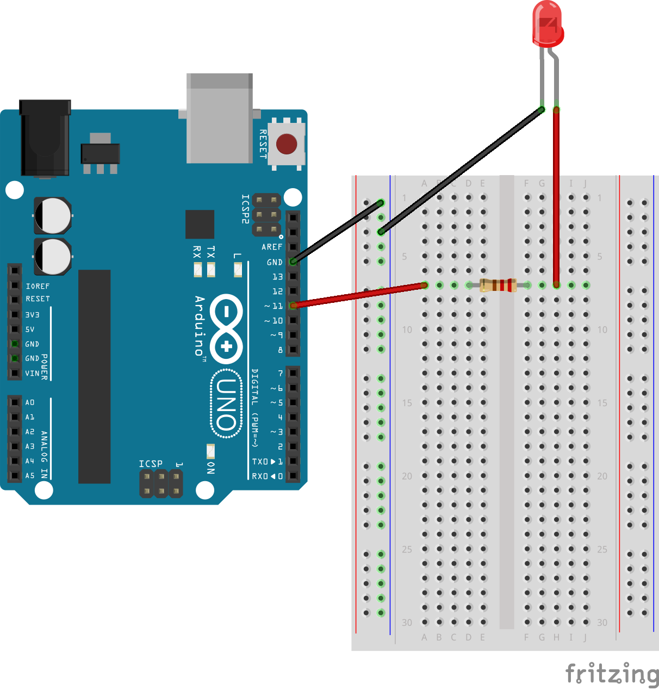
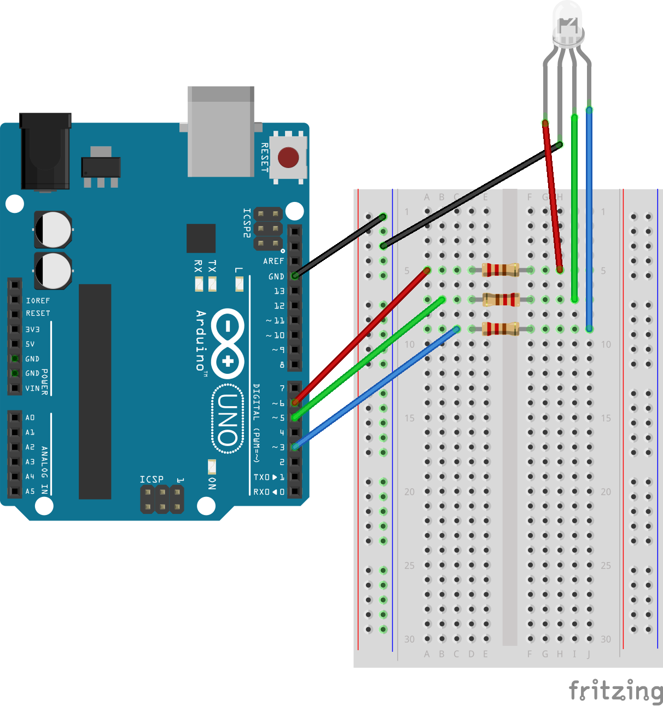

# Oppgaver - LED
En beskrivelse om hvilke typer oppgaver dette er. Fylle ut med noe greier, og kanskje legge ved noen tegninger/beskrivelser for hva man trenger for å fulleføre oppgavene.

## Oppgave 1 - La det bli lys!
For å lære seg noe nytt må man starte i det små, og så gradvis øke vanskelighetsgraden og skaffe seg mer kunnskap.
Derfor går den første oppgaven ut på å få lys i én enkelt LED.

> **Oppgave:** Skru på lyset i en LED.

### Løsningsforslag
<details>
<summary>Klikk her for koblingsskjema</summary>

</details>

<details>
<summary>Klikk her for kodesnutt</summary>
```javascript
var five = require("johnny-five");
var board = new five.Board();

board.on("ready", function() {
  var led = new five.Led(8);
  led.on();
});
```
</details>

## Oppgave 2 - To er bedre enn én
Så bra, du fikk lys i LED-lyset! Men, det er jo litt kjedelig at ett enslig lite lys lyser alene hele dagen? Hva med å skru på to lys, og ikke bare ett?
For å løse denne oppgaven må du koble til to LED og skru på lyset i begge to.

> **Oppgave:** Skru på lyset i to LED.

### Løsningsforslag
<details>
<summary>Klikk her for koblingsskjema</summary>

</details>

<details>
<summary>Klikk her for løsningsforslag</summary>
```javascript
var five = require("johnny-five");
var board = new five.Board();

board.on("ready", function() {
  var led = new five.Led(8);
  var led2 = new five.Led(7);
  led.on();
  led2.on();
});
```
</details>

## Oppgave 3 - Blink-blink
For å løse denne oppgaven må du altså få LED-lyset til å blinke hvert sekund. Av. På. Av. På. Av. På. Mennesker syns dette blir kjedelig etter hvert, men en datamaskin syns slike oppgaver er kjempegøy!


> Oppgave: Få LED-lyset til å blinke.

### Løsningsforslag
<details>
<summary>Klikk her for koblingsskjema</summary>

</details>

<details>
<summary>Klikk her for løsningsforslag</summary>
```javascript
var five = require("johnny-five");
var board = new five.Board();

board.on("ready", function() {
  var led = new five.Led(8);
  led.blink(1000);
});
```
</details>

## Oppgave X - Skru av lyset
Men, hvorfor lyser fortsatt lyset etter at man har stoppet programmet? Kanskje vi skulle ha prøvd å skru det av igjen?
Utvid programmet ditt til å skru av lyset når du stopper det.

> Oppgave: Skru av lyset ved programstopp.

### Løsningsforslag
<details>
<summary>Klikk her for koblingsskjema</summary>

</details>

<details>
<summary>Klikk her for løsningsforslag</summary>
```javascript
var five = require("johnny-five");
var board = new five.Board();

board.on("ready", function() {
  var led = new five.Led(8);
  led.on()

  this.on("exit", function() {
    led.off();
  });
});
```
</details>

## Oppgave X - Pulserende effekt
Lyset kan også pulsere, en fin effekt som det er lett å bli fascinert over. I tillegg hadde det vært fint å vite hvordan man stopper slike effekter, f.eks. etter 10 sekunder?

> Oppgave: Få lyset til å pulsere, for så å stoppe effekten etter 10 sekunder.

### Løsningsforslag
<details>
<summary>Klikk her for koblingsskjema</summary>

</details>

<details>
<summary>Klikk her for løsningsforslag</summary>
```javascript
var five = require("johnny-five");
var board = new five.Board();

board.on("ready", function() {
  // OBS - Viktig at LED-lyset er koblet til en PWM-pin!
  var led = new five.Led(11);
  led.pulse();

  this.wait(10000, function() {
    led.stop().off();
  });
});
```
</details>

## Oppgave X - Fade-in - fade-out!
Soloppganger og -nedganger er fantastisk flotte. Måten solen bare blir større og større på ved soloppganger, samt mindre og mindre ved solnedganger, blir bare flottere og flottere jo eldre man blir. Det fins egne innebygde funksjoner for slike effekter. La oss prøve!

> Oppgave: Få lyset til å fade inn, for så å fade ut igjen etter 10 sekunder.

### Løsningsforslag
<details>
<summary>Klikk her for koblingsskjema</summary>

</details>

<details>
<summary>Klikk her for løsningsforslag</summary>
```javascript
var five = require("johnny-five");
var board = new five.Board();

board.on("ready", function() {
  // OBS - Viktig at LED-lyset er koblet til en PWM-pin!
  var led = new five.Led(11);
  led.fadeIn();

  this.wait(10000, function() {
    led.fadeOut();
  });
});
```
</details>

## Oppgave X - RGB
LED-pærere brukt til nå har kun én farge. De er enten rød, grønn, gul eller blå. Lysstyrken har vi lekt litt med, men hadde det ikke vært kult å kunne bytte farge i tillegg til styrken? For å få det til må man bruke en RGB-LED-pære. Denne pæren har fire ben i stedet for bare to; ett ben per farge. På den måten kan man velge hvor mye rødt, grønt og blått det skal lyse, altså styrken for hver av disse, og på den måten kan man lage mange flotte farger!

> Oppgave: Koble opp en RGB-pære, og lys opp pæren i fargene lilla og oransje.

### Løsningsforslag
<details>
<summary>Klikk her for koblingsskjema</summary>

</details>

<details>
<summary>Klikk her for løsningsforslag</summary>
```javascript
var five = require("johnny-five");
var board = new five.Board();

board.on("ready", function() {
  var led = new five.Led.RGB({
    pins: {
      red: 6,
      green: 5,
      blue: 3
    }
  });

  led.on();
  // led.color("#9955bb"); // lilla
  // led.color("#ffa500"); // oransje
});
```
</details>
