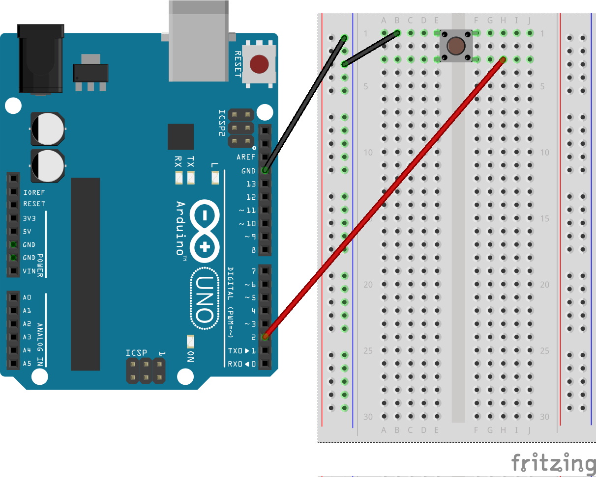
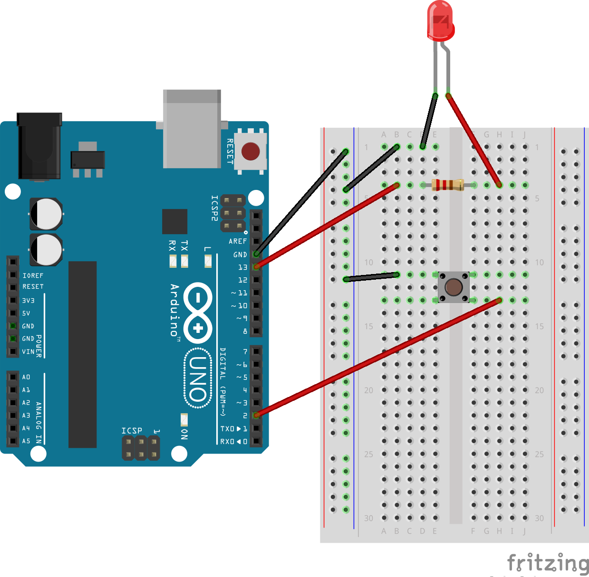

# Oppgaver - Knapper
En beskrivelse om hvilke typer oppgaver dette er. Fylle ut med noe greier, og kanskje legge ved noen tegninger/beskrivelser for hva man trenger for å fulleføre oppgavene.

## Oppgave 1 - Trykk. Logg.
LED-pærer er morsomme de, men lys er som regel bare forbundet med output, og ikke særlig gode på input.
Knapper derimot, de er kun ment for input, og er kjempemorsomme å trykke på!
Så, hvordan kan vi kontrollere hva som skjer når man trykker på en knapp? Og hvordan kobler vi til en knapp?

> Oppgave: Logg teksten "Tøft, jeg kan trykke på en knapp!" når du trykker på knappen.

### Løsningsforslag
<details>
<summary>Klikk her for koblingsskjema</summary>

</details>

<details>
<summary>Klikk her for løsningsforslag</summary>
```javascript
var five = require("johnny-five");
var board = new five.Board();

board.on("ready", function() {
  var button = new five.Button(2);

  button.on("press", function() {
    console.log( "Button pressed" );
  });
});
```
</details>

## Oppgave 2 - Skill mellom tilstandene til knappen
Tøft, du klarer nå å logge en tekst hver eneste gang du trykker på knappen! Bra jobba!
Men, visste du at knappen har flere tilstander den kan være i? Den er ikke bare "trykt inn" eller "ikke trykt inn".
Knapper har faktisk tre ulike tilstander: _hold_, _press_ og _release_.
Skriv ut ulike tekster for hver tilstand knappen er i.

> Oppgave: Logg ulike meldinger basert på om knappen er trykt ned, holdes nede eller slippes opp.

### Løsningsforslag
<details>
<summary>Klikk her for koblingsskjema</summary>

</details>

<details>
<summary>Klikk her for løsningsforslag</summary>
```javascript
var five = require("johnny-five");
var board = new five.Board();

board.on("ready", function() {
  var button = new five.Button(2);

  button.on("hold", function() {
    console.log( "Button held" );
  });

  button.on("press", function() {
    console.log( "Button pressed" );
  });

  button.on("release", function() {
    console.log( "Button released" );
  });
});
```
</details>

## Oppgave 3 - Skru på lyset
Okei, du vet nå hvordan tilstand knappen er i til enhver tid, og du vet når knappen trykkes inn.
Så, hva om vi prøver å koble knappen opp mot et LED-lys? Skru på lyset når knappen trykkes inn.

> Oppgave: Skru på LED-lyset når du trykker på knappen.

### Løsningsforslag
<details>
<summary>Klikk her for koblingsskjema</summary>

</details>

<details>
<summary>Klikk her for løsningsforslag</summary>
```javascript
var five = require("johnny-five");
var board = new five.Board();

board.on("ready", function() {
  var led = new five.Led(13);
  var button = new five.Button(2);
  button.on("press", function() {
    led.on();
  });
});
```
</details>

## Oppgave 4 - Skru av lyset igjen
Så bra! Men, hvorfor går ikke lyset av igjen? Det er fordi vi ikke har sagt at det skal gjøre det.
Så dette må legges inn, slik at lyset skrus av igjen når man slipper knappen.

> Oppgave: Skru av LED-lyset når du slipper opp knappen.

### Løsningsforslag
<details>
<summary>Klikk her for koblingsskjema</summary>

</details>

<details>
<summary>Klikk her for løsningsforslag</summary>
```javascript
var five = require("johnny-five");
var board = new five.Board();

board.on("ready", function() {
  var led = new five.Led(13);
  var button = new five.Button(2);
  button.on("press", function() {
    led.on();
  });

  button.on("release", function() {
    led.off();
  });
});
```
</details>
